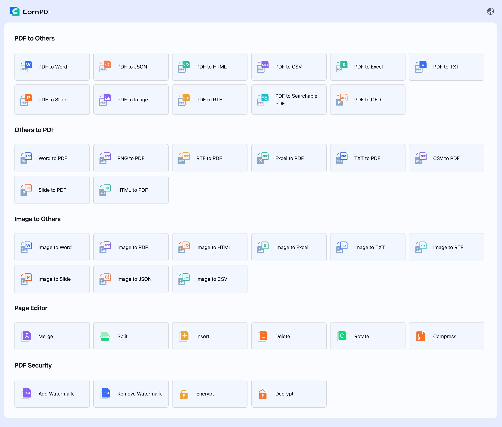
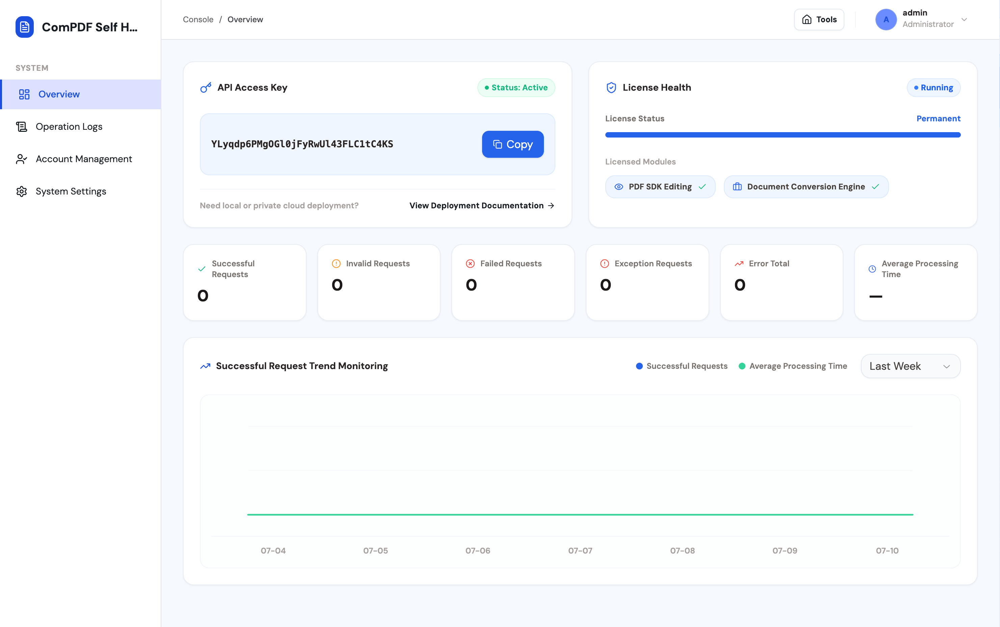

[English](README.md) | [繁體中文](README_TW.md) | [简体中文](README_CN.md)

# ComPDF Self-hosted — 开源 PDF 编辑器与 PDF 转换器

通过 [ComPDF Self-hosted](https://www.compdf.com/self-hosted-deployment?utm_source=github_ai_sefhosted_open_zh&utm_medium=referral&utm_campaign=github_ai_sefhosted_open_zh&ref_platform_id=github_compdfkit_zh) (KDAN 生态），可快速完成基于 Docker 容器的私有化部署，实现编辑、转换和处理 PDF、Office 格式、HTML、TXT、CSV、RTF、JSON 及图片等文档。


> - 如果您觉得 ComPDF Self-hosted 实用，请考虑在 GitHub 上为我们点一颗 ⭐ **Star**，这有助于我们成长与改进。
> 
> - 有任何问题或想法？欢迎加入我们的 [Discussions](https://github.com/ComPDF/compdf-self-hosted/discussions) 讨论。

<p align="center">
  <a href="#"></a>
  <a href="#"></a>
  <a href="#"></a>
  <a href="#"></a>
</p>

<p align="center">
  <a href="#功能支持"><b>功能支持</b></a> •
  <a href="#快速开始"><b>快速开始</b></a> •
  <a href="#系统架构"><b>系统架构</b></a> •
  <a href="#升级至企业版"><b>升级至企业版</b></a> •
   <a href="#支持"><b>支持</b></a> •
  <a href="#许可协议"><b>许可协议</b></a> •
  <a href="https://www.compdf.com/contact-sales?utm_source=github&utm_medium=referral&utm_campaign=compdf_self_hosted_open&ref_platform_id=github_compdfkit" target="_blank"><b>企业版 →</b></a>
</p>

## 为什么选择 ComPDF Self-hosted？

不同于需要深度集成的传统 SDK，ComPDF 自托管版是一个可直接部署的开源 PDF 处理平台。它集 PDF 编辑、转换于一身，同时支持图像转换处理，让企业快速拥有自主可控的文档中心。

### 主要优势

* Docker Compose 部署
* 完整的 PDF 工具中心——编辑、转换、合并、拆分
* API 密钥管理与许可证管理
* 私有部署，架构符合企业级标准
* 提供商业支持与专属技术支持

无论您正在搭建内部文档平台、文档自动化流程还是企业 PDF 服务，ComPDF Self-hosted 都能让您在几分钟内快速上手。

<a id="features"></a>

## 功能支持

### 1. PDF 工具中心




ComPDF Self-hosted 提供可直接在浏览器中使用的**开源 PDF 编辑器**、**开源 PDF 转换器**与**开源图片转换器**中心。

| 功能类别      | 功能详情                                                                                                                                                                                     |
| --------- | ---------------------------------------------------------------------------------------------------------------------------------------------------------------------------------------- |
| PDF 编辑    | 合并 PDF，拆分 PDF，旋转 PDF，插入页面，删除页面，提取页面，添加水印，移除水印，加密 PDF，解密 PDF                                                                                                                              |
| PDF 转其他格式 | PDF 转 Word，PDF 转 Excel，PDF 转 Slide，PDF 转图片（PNG，JPG，JPEG，JPEG2000，BMP，TIFF，TGA，GIF，WEBP），PDF 转 HTML，PDF 转 TXT，PDF 转 CSV，PDF 转 RTF，PDF 转 JSON，PDF 转 SearchablePDF，PDF 转 OFD，PDF 转 Markdown |
| 其他格式转 PDF | Word 转 PDF，Excel 转 PDF，Slide 转 PDF，HTML 转 PDF，TXT 转 PDF，CSV 转 PDF，RTF 转 PDF，PNG 转 PDF                                                                                                    |
| 图片转其他格式   | 图片转 Word，图片转 Excel，图片转 Slide，图片转 HTML，图片转 CSV，图片转 TXT，图片转 RTF，图片转 JSON，图片转 PDF                                                                                                           |

### 2. Dashboard 控制台

ComPDF Self-hosted 提供统一管理控制台，用于查看 API Key、API 调用情况与 License 状态，并支持操作日志审计、账号管理及系统基础配置等核心功能。



* 概览面板：展示 API Key 详情、API 调用统计、License 授权范围及使用状态等信息。
* 操作日志：跟踪、搜索并导出所有操作日志
* 账号管理：设置用户名和密码
* 系统设置：配置系统名称、Logo 和主题色

<a id="quick-start"></a>

## 快速开始

### 1. 使用 Docker Compose 启动

1. 克隆仓库并进入项目目录：

```bash
git clone https://github.com/ComPDF/compdf-self-hosted.git
cd compdf-self-hosted
```

2. 启动服务前先准备环境文件：

```bash
cp .env.example .env
```

`.env` 中默认内置免费 License，用于本地开发、功能体验与接口验证。Docker Compose
会自动读取项目目录下的 `.env`。

3. 启动完整服务：

```bash
docker compose up -d
```

4. 打开 ComPDF Web 和 Dashboard：

```text
ComPDF Web: http://localhost:8080/
Dashboard:  http://localhost:8080/admin
```

首次部署时，Dashboard 默认管理员账号为：`admin / admin`

如需使用正式版许可证，请将申请到的正式 License Key 替换到 `.env` 文件中的
`COMPDF_LICENSE_KEY` 字段。License Key 修改后需要重启服务以生效。

**[申请正式版许可证](https://www.compdf.com/contact-sales?utm_source=github_ai_sefhosted_open_zh&utm_medium=referral&utm_campaign=github_ai_sefhosted_open_zh&ref_platform_id=github_compdfkit_zh)，可获得以下权益：**

* 无水印文档处理
* 无文档页数限制
* 批量文档处理

### 2. 启动开发环境

开发环境使用 Docker 启动基础设施与 SDK 服务，Server 服务和 Web UI 可在本地运行，
方便热更新调试。

启动开发环境：

```bash
docker compose -f docker-compose.dev.yml up -d --build compdf-infra compdf-app compdf-server
docker compose -f docker-compose.dev.yml ps
```

Server API url:

```text
http://localhost:8080/api/v1/
```

也可查看[文档](https://www.compdf.com/guides/pdf-sdk/self-hosted-deployment/overview?utm_source=github_ai_sefhosted_open_cn&utm_medium=referral&utm_campaign=github_ai_sefhosted_open_cn&ref_platform_id=github_compdfkit_cn)

打开 ComPDF Web 和 Dashboard：

```text
ComPDF Web: http://localhost:8080/
Dashboard:  http://localhost:8080/admin
```

### 3. 查看状态和日志

```bash
docker compose ps
docker compose logs -f compdf-server
```

生产部署会把持久化数据存放在 Docker volumes 中，并将 `./configs` 挂载到 Server 容器。

### 4. 从源码打包生产环境镜像

如果修改了本地源码，需要从根目录 `Dockerfile` 重新打包生产环境
`compdf-server` 镜像，请使用以下命令。Dockerfile 会构建 `frontend/compdf-web`
中的 ComPDF Web 与 Dashboard，并将静态资源复制到 `/app/public/compdf-web`；
随后构建 Server 服务端，在 `8080` 端口统一提供页面和 API。

```bash
docker compose -f docker-compose.yml up -d --build compdf-infra compdf-app compdf-server
```

以上功能均可在 [ComPDF](https://www.compdf.com/?utm_source=github_ai_sefhosted_open_cn&utm_medium=referral&utm_campaign=github_ai_sefhosted_open_cn&ref_platform_id=github_compdfkit_cn) 上体验使用，→[体验地址](https://www.compdf.com/pdf-tools?utm_source=github_ai_sefhosted_open_cn&utm_medium=referral&utm_campaign=github_ai_sefhosted_open_cn&ref_platform_id=github_compdfkit_cn)

<a id="architecture"></a>

## 系统架构

```text
┌────────────────────────────────────────────────────────────────────┐
│                              Browser                               │
│          生产环境访问 / 使用 ComPDF Web，访问 /admin 使用 Dashboard       │
└───────────────────────────────┬────────────────────────────────────┘
                                │
                                │ HTML/CSS/JS + HTTP /api/v1/*
                                ▼
┌────────────────────────────────────────────────────────────────────┐
│                       compdf-server container                      │
│          ComPDF Web + Dashboard + Server, port 8080                │
├────────────────────────────────────────────────────────────────────┤
│ - 从 /app/public/compdf-web 提供 ComPDF Web 与 Dashboard             │
│ - ComPDF Web 使用 /api/v1/process/* 和 /api/v1/task/* 完成文档处理       │
│ - Dashboard 使用 /api/v1/dashboard/* 管理 API Key、License、日志和设置    │
│ - 编排异步任务状态、取消与下载                                           │
│ - 向页面注入品牌配置、API Key 和仅用于展示的 license 元数据                 │
│ - 标准化处理服务错误并写入操作日志                                        │
└───────────────┬───────────────────────────────┬────────────────────┘
                │                               │
                │ HTTP                          │ MySQL / Redis
                ▼                               ▼
┌────────────────────────────────┐   ┌────────────────────────────────┐
│ compdf-app container           │   │ compdf-infra container         │
│                                │   │ MySQL 8 + Redis 7 + RustFS     │
│                                │   │ 持久化 Docker volumes           │
└────────────────────────────────┘   └────────────────────────────────┘
                │
                ▼
┌────────────────────────────────────────────────────────────────────┐
│                         项目挂载数据                                 │
├────────────────────────────────────────────────────────────────────┤
│ configs/: license.jwt、settings.yml、init.sql                       │
│ storage/: 异步任务结果文件                                            │
│ fonts/: 可选字体，挂载到 SDK 容器                                      │
└────────────────────────────────────────────────────────────────────┘
```

本地开发时，`compdf-infra`、`compdf-app` 和 `compdf-server` 都通过
`docker-compose.dev.yml` 运行，以保证服务之间的连接方式与实际部署拓扑一致。

<a id="upgrade-to-enterprise"></a>

## 升级至企业版

[联系销售](https://www.compdf.com/contact-sales?utm_source=github_ai_sefhosted_open_cn&utm_medium=referral&utm_campaign=github_ai_sefhosted_open_cn&ref_platform_id=github_compdfkit_cn)  升级至 **Enterprise 版**

| 功能     | 免费版 | 企业版 |
| ------ | --- | --- |
| PDF 编辑 | ✅   | ✅   |
| PDF 转换 | ✅   | ✅   |
| Web 界面 | ✅   | ✅   |
| 仪表板    | ✅   | ✅   |
| 无水印输出  | ❌   | ✅   |
| 不限制页数  | ❌   | ✅   |
| 自定义并发数 | ❌   | ✅   |
| 商业许可证  | ❌   | ✅   |
| 技术支持   | ❌   | ✅   |

## 文档

### 开发文档

https://www.compdf.com/documentation?utm_source=github_ai_sefhosted_open_cn&utm_medium=referral&utm_campaign=github_ai_sefhosted_open_cn&ref_platform_id=github_compdfkit_cn

### API Reference

https://www.compdf.com/guides/pdf-sdk/self-hosted-deployment/api-reference-conversion?utm_source=github_ai_sefhosted_open_cn&utm_medium=referral&utm_campaign=github_ai_sefhosted_open_cn&ref_platform_id=github_compdfkit_cn

### SDK 文档

https://www.compdf.com/guides/pdf-sdk/self-hosted-deployment/overview?utm_source=github_ai_sefhosted_open_cn&utm_medium=referral&utm_campaign=github_ai_sefhosted_open_cn&ref_platform_id=github_compdfkit_cn

<a id="support"></a>

## 支持

有任何建议？[发起讨论](https://github.com/ComPDF/compdf-self-hosted/discussions)。如果您觉得 **ComPDF Self-hosted** 实用，请考虑在 GitHub 上为我们点一颗 ⭐ **Star**，这有助于我们成长与改进。

<a id="license"></a>

## 许可协议

- 本项目采用 MIT 许可协议。详见 LICENSE 文件。
- ComPDF Self-hosted 的商业版/企业版许可证请[联系销售团队](https://www.compdf.com/contact-sales?utm_source=github_ai_sefhosted_open_zh&utm_medium=referral&utm_campaign=github_ai_sefhosted_open_zh&ref_platform_id=github_compdfkit_zh)。

---

<p align="center">
  <b>ComPDF 团队打造</b><br>
  <a href="https://compdf.com?utm_source=github_ai_sefhosted_open_zh&utm_medium=referral&utm_campaign=github_ai_sefhosted_open_zh&ref_platform_id=github_compdfkit_zh">官网</a> ·
  <a href="https://www.compdf.com/guides/idp/self-hosted-deployment/overview?utm_source=github_ai_sefhosted_open_zh&utm_medium=referral&utm_campaign=github_ai_sefhosted_open_zh&ref_platform_id=github_compdfkit_zh">技术文档</a> ·
  <a href="https://www.compdf.com/contact-sales?utm_source=github_ai_sefhosted_open_zh&utm_medium=referral&utm_campaign=github_ai_sefhosted_open_zh&ref_platform_id=github_compdfkit_zh">企业咨询</a>
</p>
