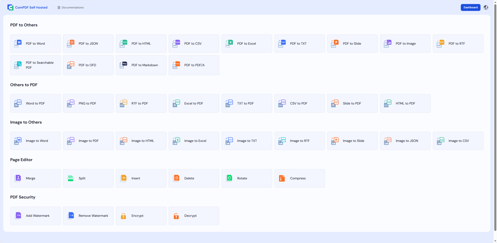
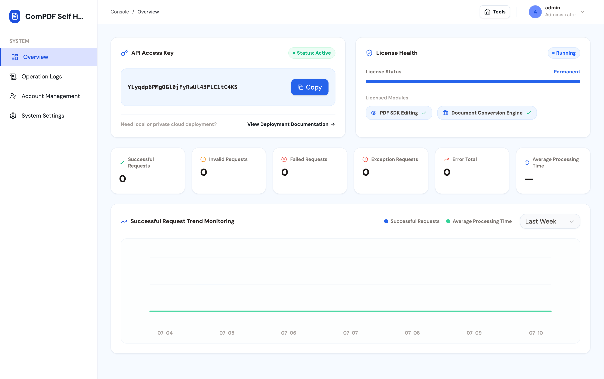

# ComPDF Self-Hosted — 開源 PDF 編輯器與 PDF 轉檔工具

[ComPDF Self-Hosted](https://www.compdf.com/self-hosted-deployment?utm_source=github_ai_selfhosted_oldopen_tw&utm_medium=referral&utm_campaign=github_ai_selfhosted_oldopen_tw&ref_platform_id=github_compdf_tw) 是 KDAN 生態系的一部分，提供可私有化部署的 PDF 編輯與轉檔功能，幫助團隊在私有 Docker 環境中安全處理 PDF、Office 文件與圖片。

> * 如果您覺得 ComPDF Self-Hosted 實用，請考慮在 GitHub 上為我們點亮一顆 ⭐ **Star**，支持我們持續成長與改進。
> * 有任何問題或想法？歡迎前往 [Discussions](https://github.com/ComPDFKit/compdf-self-hosted) 與我們交流。

<p align="center">
  <a href="#"></a>
  <a href="#"></a>
  <a href="#"></a>
  <a href="#"></a>
</p>

<p align="center">
    <a href="#功能"><b>功能</b></a> •
  <a href="#快速開始"><b>快速開始</b></a> •
  <a href="#系統架構"><b>系統架構</b></a> •
  <a href="#升級至企業版"><b>升級至企業版</b></a> •
   <a href="#支援"><b>支援</b></a> •
  <a href="#授權條款"><b>授權條款</b></a> •
  <a href="https://www.compdf.com/contact-sales?utm_source=github&utm_medium=referral&utm_campaign=compdf_self_hosted_oldopen&ref_platform_id=github_compdfkit" target="_blank"><b>企業版 →</b></a>
</p>

## 為什麼選擇 ComPDF Self-Hosted？

不同於需要深度整合的傳統 SDK，ComPDF Self-Hosted 是一套可直接部署的開源 PDF 處理平台。平台整合 PDF 編輯、文件轉檔與圖片轉檔功能，涵蓋完整的文件與圖片處理需求，讓企業能快速建置自主可控的文件處理中心。

### 主要優勢

* 支援 Docker Compose 部署
* 完整的 PDF 工具中心——編輯、轉檔、合併、分割
* 支援 API key管理與授權管理
* 支援私有化部署，採用符合企業級需求的系統架構
* 提供商業支援與專屬技術協助


無論您正在建置內部文件平台、文件自動化流程或企業 PDF 服務，ComPDF Self-Hosted 都能讓您在幾分鐘內快速上手。

<a id="features"></a>

## 功能



### 1. PDF 工具中心

ComPDF Self-Hosted 提供可直接在瀏覽器中使用的**開源 PDF 編輯器、開源 PDF 轉檔工具與開源圖片轉檔**工具中心。

| 類別  | 功能  |
| --- | --- |
| PDF 編輯 | 合併 PDF、分割 PDF、旋轉 PDF、插入頁面、刪除頁面、擷取頁面、新增浮水印、移除浮水印、加密 PDF、解密 PDF |
| PDF 轉其他格式 | PDF 轉 Word、PDF 轉 Excel、PDF 轉 Slide、PDF 轉 Image（PNG、JPG、JPEG、JPEG2000、BMP、TIFF、TGA、GIF、WEBP）、PDF 轉 HTML、PDF 轉 TXT、PDF 轉 CSV、PDF 轉 RTF、PDF 轉 JSON、PDF 轉 Searchable PDF、PDF 轉 OFD、PDF 轉 Markdown |
| 其他格式轉 PDF | Word 轉 PDF、Excel 轉 PDF、Slide 轉 PDF、HTML 轉 PDF、TXT 轉 PDF、CSV 轉 PDF、RTF 轉 PDF、PNG 轉 PDF |
| 圖片轉其他格式 | 圖片轉 Word、圖片轉 Excel、圖片轉 Slide、圖片轉 HTML、圖片轉 CSV、圖片轉 TXT、圖片轉 RTF、圖片轉 JSON、圖片轉 PDF |

### 2. Dashboard 管理控制台

ComPDF Self-Hosted 提供統一的管理控制台，用於查看 API Key、API 呼叫情況與 License 狀態，並支援操作紀錄稽核、帳號管理及系統基本設定等核心功能。



* 總覽面板：顯示 API Key 詳細資訊、API 呼叫資料、授權（License）範圍及狀態等資訊。
* 操作日誌：追蹤、搜尋，並匯出所有操作日誌
* 帳號管理：設定使用者名稱與密碼
* 系統設定：設定系統名稱、標誌與主題色


<a id="快速開始"></a>

## 快速開始

### 1. 使用 Docker Compose 啟動

**複製儲存庫並進入專案目錄：**

``` 
    git clone https://github.com/ComPDF/compdf-self-hosted.git
    cd compdf-self-hosted
``` 

**啟動服務前，請先準備環境設定檔：**

``` 
    cp .env.example .env
``` 

`.env` 預設內建免費 License，可用於地端開發、功能體驗與介面驗證。Docker Compose 會自動讀取專案目錄下的 `.env`。

**啟動完整服務：**
``` 
    docker compose up -d
``` 

**開啟 ComPDF Web 和 Dashboard：**
``` 
    ComPDF Web: http://localhost:8080/
    Dashboard:  http://localhost:8080/admin
``` 
首次部署時，Dashboard 的預設管理員帳號與密碼為：`admin / admin`

如需使用正式版授權，請將申請取得的正式 License Key 填入 `.env` 檔案中的 `COMPDF_LICENSE_KEY` 欄位。修改 License Key 後，需重新啟動服務才會生效。

**[申請正式版授權](https://www.compdf.com/contact-sales?utm_source=github_ai_seLfhosted_oldopen_tw&utm_medium=referral&utm_campaign=github_ai_seLfhosted_oldopen_tw&ref_platform_id=github_compdf_tw)，即可使用以下功能：**

* 輸出文件不含浮水印
* 不限制文件頁數
* 支援批次文件處理

### 2. 啟動開發環境

開發環境會透過 Docker 啟動基礎設施與 SDK 服務，而 Server 服務與 Web UI 則可在本機執行，方便使用熱重載（Hot Reload）進行除錯。

啟動開發環境：

    docker compose -f docker-compose.dev.yml up -d --build compdf-infra compdf-app compdf-server

開啟 ComPDF Web 和 Dashboard：

    cd frontend/compdf-web
    npm install
    npm run dev

開發環境存取地址 & Server API 位址：

    ComPDF Web: http://localhost:5173/
    Dashboard:  http://localhost:5173/admin
    Server API: http://localhost:8080/api/v1/

您也可以查看相關技術[文件](https://www.compdf.com/guides/pdf-sdk/self-hosted-deployment/overview?utm_source=github_ai_seLfhosted_oldopen_tw&utm_medium=referral&utm_campaign=github_ai_seLfhosted_oldopen_tw&ref_platform_id=github_compdf_tw)。

### 3. 查看狀態和日誌

    docker compose -f docker-compose.dev.yml ps
    docker compose -f docker-compose.dev.yml logs -f compdf-infra compdf-app

在正式環境中，持久化資料會儲存在 Docker volumes，並將 `./configs` 掛載至 Server 容器。

### 4. 從原始碼建置正式環境映像檔

如已修改地端原始碼，需透過根目錄中的 Dockerfile 重新建置正式環境使用的 `compdf-server` 映像檔。請執行以下命令。Dockerfile 會先建置 `frontend/compdf-web`中的 ComPDF Web 與 Dashboard，並將靜態資源複製至 `/app/public/compdf-web`；接著建置 Server 服務，透過 `8080` 連接埠統一提供頁面和 API。

    docker compose -f docker-compose.yml up -d --build compdf-infra compdf-app compdf-server

以上功能皆可於 [ComPDF](https://www.compdf.com/?utm_source=github_ai_seLfhosted_oldopen_tw&utm_medium=referral&utm_campaign=github_ai_seLfhosted_oldopen_tw&ref_platform_id=github_compdf_tw) 線上體驗。→ [體驗連結](https://www.compdf.com/pdf-tools?utm_source=github_ai_seLfhosted_oldopen_tw&utm_medium=referral&utm_campaign=github_ai_seLfhosted_oldopen_tw&ref_platform_id=github_compdf_tw)

<a id="系統架構"></a>

## 系統架構


```text
┌────────────────────────────────────────────────────────────────────┐
│                           Browser                                                                                           │
│       正式環境存取 / 使用 ComPDF Web 存取 /admin 使用 Dashboard      │
└───────────────────────────────┬────────────────────────────────────┘ 
                                │ 
                                │ HTML/CSS/JS + HTTP /api/v1/* 
                                ▼
┌──────────────────────────────────────────────────────────────────── ┐
│                        compdf-server container                      │
│              ComPDF Web + Dashboard + Server, port 8080             │
├────────────────────────────────────────────────────────────────────┤
│ - 從 /app/public/compdf-web 提供 ComPDF Web 與 Dashboard            │
│ - ComPDF Web 使用 /api/v1/process/* 和 /api/v1/task/* 執行文件處理   │
│ - Dashboard 使用 /api/v1/dashboard/* 管理 API Key、License、日誌和設定│
│ - 編排非同步任務狀態、取消與下載                                      │
│ - 將品牌設定、API Key 與僅供顯示的 License metadata 匯入頁面          │
│ - 標準化處理服務錯誤，並寫入操作日誌                                  │
└───────────────┬───────────────────────────────┬────────────────────┘ 
                │                               │ 
                │ HTTP                          │ MySQL / Redis 
                ▼                               ▼
┌────────────────────────────────┐    ┌────────────────────────────────┐
│ compdf-app container           │    │ compdf-infra container         │
│                                │    │ MySQL 8 + Redis 7 + RustFS     │
│                                │    │ 持久化 Docker volumes           │
└────────────────────────────────┘    └────────────────────────────────┘
              │ 
              ▼
┌────────────────────────────────────────────────────────────────────┐
│                             專案掛載資料                            │
├────────────────────────────────────────────────────────────────────┤
│ configs/: license.jwt、settings.yml、init.sql                      │
│ storage/: 非同步任務產生的結果檔案                                   │
│ fonts/: 選用字型，掛載至 SDK 容器                                    │
└────────────────────────────────────────────────────────────────────┘
```


在地端開發環境中，`compdf-infra`、`compdf-app` 和 `compdf-server` 皆透過 `docker-compose.dev.yml` 執行，以確保服務之間的連線方式與正式部署架構一致。

<a id="升級至企業版"></a>

## 升級至企業版

[請聯絡銷售團隊](https://www.compdf.com/contact-sales?utm_source=github_ai_seLfhosted_oldopen_tw&utm_medium=referral&utm_campaign=github_ai_seLfhosted_oldopen_tw&ref_platform_id=github_compdf_tw)，將方案升級至 **Enterprise** 版。

| 功能  | 免費版 | 企業版 |
| --- | --- | --- |
| PDF 編輯 | ✅   | ✅   |
| PDF 轉檔 | ✅   | ✅   |
| Web 介面 | ✅   | ✅   |
| Dashboard 管理控制台 | ✅   | ✅   |
| 輸出文件不含浮水印 | ❌   | ✅   |
| 不限制頁數 | ❌   | ✅   |
| 自訂併發數 | ❌   | ✅   |
| 商業授權 | ❌   | ✅   |
| 技術支援 | ❌   | ✅   |

## 技術文件

* 開發文件：[https://www.compdf.com/guides/pdf-sdk/self-hosted-deployment/overview](https://www.compdf.com/guides/pdf-sdk/self-hosted-deployment/overview?utm_source=github_ai_seLfhosted_open_tw&utm_medium=referral&utm_campaign=github_ai_seLfhosted_open_tw&ref_platform_id=github_compdfkit_tw)
  
* API Reference：[https://www.compdf.com/guides/pdf-sdk/self-hosted-deployment/api-reference-conversion](https://www.compdf.com/guides/pdf-sdk/self-hosted-deployment/api-reference-conversion?utm_source=github_ai_seLfhosted_open_tw&utm_medium=referral&utm_campaign=github_ai_seLfhosted_open_tw&ref_platform_id=github_compdfkit_tw)
  

<a id="支援"></a>

## 支援

有任何建議？[歡迎發起討論](https://github.com/ComPDF/compdf-self-hosted/discussions)。如果您覺得 ComPDF Self-Hosted 實用，歡迎在 GitHub 上為我們點亮一顆 ⭐ **Star**，支持我們持續成長與改進。


<a id="授權條款"></a>

## 授權條款

* 本專案採用 MIT 授權條款。詳見 LICENSE 檔案。
* 如需取得 ComPDF Self-Hosted 商業版或企業版授權，請聯絡[銷售團隊](https://www.compdf.com/contact-sales?utm_source=github_ai_seLfhosted_open_tw&utm_medium=referral&utm_campaign=github_ai_seLfhosted_open_tw&ref_platform_id=github_compdfkit_tw)。

---

<p align="center">
  <b>由 ComPDF 團隊打造</b><br>
  <a href="https://compdf.com?utm_source=github_ai_seLfhosted_open_tw&utm_medium=referral&utm_campaign=github_ai_seLfhosted_open_tw&ref_platform_id=github_compdfkit_tw">官網</a> ·
  <a href="https://www.compdf.com/guides/pdf-sdk/self-hosted-deployment/overview?utm_source=github_ai_seLfhosted_open_tw&utm_medium=referral&utm_campaign=github_ai_seLfhosted_open_tw&ref_platform_id=github_compdfkit_tw">技術文件</a> ·
  <a href="https://www.compdf.com/contact-sales?utm_source=github_ai_seLfhosted_open_tw&utm_medium=referral&utm_campaign=github_ai_seLfhosted_open_tw&ref_platform_id=github_compdfkit_tw">企業洽詢</a>
</p>
